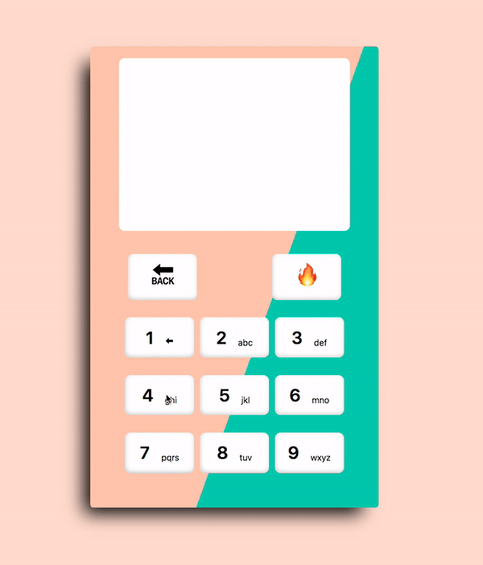

# Converter

> T9 conversion tool
>
> Note:
>
>pagination was used in order to display all the words
>
>redux-thunk was chosen for API request handling over api middleware as there was just one type of request
>

Installation
----

+ Follow installation steps of the [backend](https://github.com/KarinaDavtyan/converter-backend)

+ Run commands :arrow_down:

`git clone https://github.com/KarinaDavtyan/converter.git`

`cd converter`

`yarn install`

`yarn start`

or

`yarn test` for testing

Usage
----

Use phone like keyboard for typing a text

Special buttons:

`⬅` remove last character

`🔙` go to previous page

`🔥` remove all

Screenshots
----

➡️ [Desktop View](src/assets/desktopView.png)

➡️ [Mobile View](src/assets/mobileView.png)

Tech-stack
----

+ React + Redux
